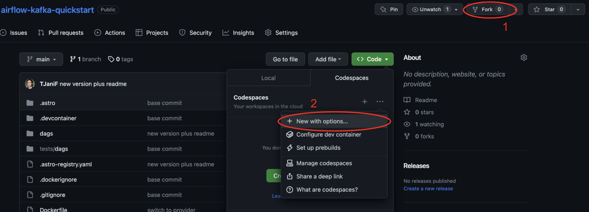
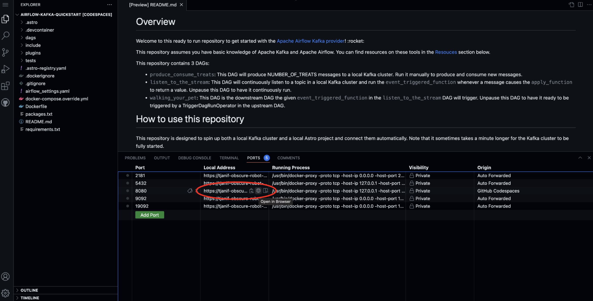

# Overview

Welcome to this ready to run repository to get started with the [Apache Airflow Kafka provider](https://airflow.apache.org/docs/apache-airflow-providers-apache-kafka/stable/index.html)! :rocket:

This repository assumes you have basic knowledge of Apache Kafka and Apache Airflow. You can find resources on these tools in the [Resouces](#resources) section below.

This repository contains 3 DAGs:

- `produce_consume_treats`: This DAG will produce NUMBER_OF_TREATS messages to a local Kafka cluster. Run it manually to produce and consume new messages.
- `listen_to_the_stream`: This DAG will continuously listen to a topic in a local Kafka cluster and run the `event_triggered_function` whenever a message causes the `apply_function` to return a value. Unpause this DAG to have it continuously run.
- `walking_your_pet`: This DAG is the downstream DAG the given `event_triggered_function` in the `listen_to_the_stream` DAG will trigger. Unpause this DAG to have it ready to be triggered by a TriggerDagRunOperator in the upstream DAG.

# How to use this repository

This repository is designed to spin up both a local Kafka cluster and a local Astro project and connect them automatically. Note that it sometimes takes a minute longer for the Kafka cluster to be fully started.

## Option 1: Use GitHub Codespaces

Run this Airflow project without installing anything locally.

1. Fork this repository.
2. Create a new GitHub codespaces project on your fork. Make sure it uses at least 4 cores!

    

3. After creating the codespaces project the Astro CLI will automatically start up all necessary Airflow components as well as the local Kafka cluster, using the instructions in the `docker-compose.override.yml`. This can take a few minutes. 
4. Once the Airflow project has started access the Airflow UI by clicking on the **Ports** tab and opening the forward URL for port 8080. You can log in using `admin` as the username and `admin` as the password.

    

5. Unpause all DAGs. Manually run the `produce_consume_treats` DAG to see the pipeline in action. Note that a random function is used to generate parts of the message to Kafka which determines if the `listen_for_mood` task will trigger the downstream `walking_your_pet` DAG. You might need to run the `produce_consume_treats` several times to see the full pipeline in action!

## Option 2: Use the Astro CLI

Download the [Astro CLI](https://docs.astronomer.io/astro/cli/install-cli) to run Airflow locally in Docker. `astro` is the only package you will need to install.

1. Run `git clone https://github.com/astronomer/airflow-quickstart.git` on your computer to create a local clone of this repository.
2. Install the Astro CLI by following the steps in the [Astro CLI documentation](https://docs.astronomer.io/astro/cli/install-cli). Docker Desktop/Docker Engine is a prerequisite, but you don't need in-depth Docker knowledge to run Airflow with the Astro CLI.
3. Run `astro dev start` in your cloned repository.
4. After your Astro project has started. View the Airflow UI at `localhost:8080`. You can log in using `admin` as the username and `admin` as the password.
5. Unpause all DAGs. Manually run the `produce_consume_treats` DAG to see the pipeline in action. Note that a random function is used to generate parts of the message to Kafka which determines if the `listen_for_mood` task will trigger the downstream `walking_your_pet` DAG. You might need to run the `produce_consume_treats` several times to see the full pipeline in action!

# Resources

- [Use Apache Kafka with Apache Airflow tutorial](https://docs.astronomer.io/learn/airflow-kafka).
- [Apache Kafka Airflow provider documentation](https://airflow.apache.org/docs/apache-airflow-providers-apache-kafka/stable/index.html).
- [Apache Kafka documentation](https://kafka.apache.org/documentation/). 
- [Apache Airflow documentation](https://airflow.apache.org/docs/apache-airflow/stable/index.html).
- [Airflow Quickstart](https://docs.astronomer.io/learn/airflow-quickstart).
